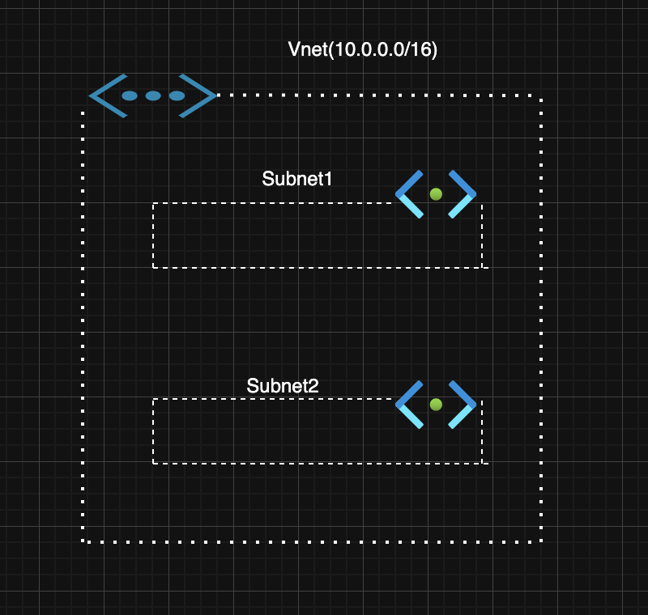

# Azure Networking

## Virtual Network (VNet)

* Azure Virtual Networks (VNets) form the core of private networking in Azure Cloud.

* They create isolated networks similar to on-premises networks with Azure's scalability, availability, and security.

* Support customizable DNS settings.

* Secure Comunication across resources
    * Internet communication
    * Azure Resource Communication
    * Onprem communication (using point to site VPN, Site to Site VPN or Azure ExpressRoute)
* Filtering network traffic
* Routing network traffic

* Virtual networks offer traffic control between subnets through network security groups and network virtual appliances like firewalls and proxies.

### Subnets

Subnets are a divisions within VNet.
It helps organize and isolate resources for enhanced security and efficiency by breaking down a virtual network into smaller subnets.

Subnets also allow you to apply specific network security configurations, like network security groups, to control traffic at the subnet level.





## Vnet Designing Considerations

* Address space and subnetting
* Multiple Vnets and subnets
* Private IP Adress Ranges (Non-routable IP addresses as defined in RFC1918)
    * 10.0.0.0/8
    * 172.16.0.0/12
    * 192.168.0.0/16
* You should be always using Azure Virtual Network Cidr out of these ranges only for the private networking.
* IP address Allocation and Reservation
    * Azure reserves the first four and the last IP address in `each subnet` for internal purpose, which includes network address, default gateway, Azure DNS, IP mapping and broadcast address.
        ```
        Vnet CIDR: 192.168.1.0/24 = 256 IP
        10 subnet means 10 x 5 = 50 IP
        256-50 = 206 usable Ip

        ```
    * When you work in cloud, keep your networks bigger so that you can easily add subnets and expand the networks in cloud.
    * These days feature like auto scaling and PaaS services. Need a lot of IP spare in your networks.

* Address Space Planning
    * Avoid Overlapping CIDR block (can cause routing conflicts and n/w issues)
    * Addressing for future expansion
    * Services Specific Subnets
* Security & Isolation requirements (if isolation needed b/w application/departments etc)
* Hybrid Connectivity
    * Onprem Connectivity
    * Azure service connectivity

* Please check **[Virtual Network Design and Segmentation](/data/design.md)**


### Azure Public Ip's

A public IP address is an IP address that is reachable from the internet.

In Azure, a public IP address enables internet communication to resources within your virtual network by assigning a unique IP address to each resource that needs to be accessible from outside the Azure network.

Public IP can be assigned to various Azure resources such as virtual machines, Azure load Balancer and application gateways to facilitate internet communication.

Considerations

* Only assign public IPS when absolutely necessary for internal workload.
* Use private IPS to reduce exposure to the internet, and the more you open up your workload to the internet, your depth in defence strategy will always need to have many other considerations.
* You should always use any firewalls or application gateways to restrict access to resources with public IPS, and limit the attack surface for workloads exposed to the internet.


