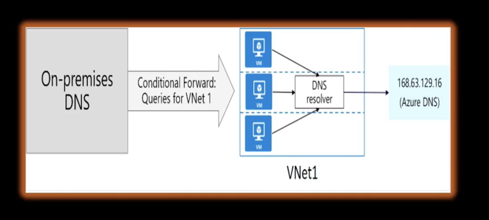

# Name resolution services in Azure

## **Azure Provided DNS:** 
Default internal DNS for VM's within Vnet. (Basic VNet name resolution)

* Automatically available no setup required
* Azure creates an internal DNS zone as soon as the VNet is created
* This zone automatically registers the name of the VM's created within the VNet
* Namespace (.internal.cloudapp.net)

## **Azure Private DNS:** 
Private DNS zones for internal resources across Vnets. (Name resolution for private Azure resources)

* Azure private DNS zones are a solution within Azure for managing DNS in a private network environment.
* They are specifically designed to handle internal resources that require name resolution, but without
exposure to the public internet.
* Private DNS zones are accessible only to internal Azure resources and cannot be accessed from the internet.
* They offer a secure way to manage name resolution within the private Azure environment.
* Private DNS zones are replicated across all Azure regions.
* It also provides global accessibility and high resilience.
* Can be accessed from any Azure region, subscription, virtual network or even across different tenants.
* Can define specific DNS names for your private zone.
* Can manually create DNS records as needed, which allows for greater customization and control.
* can support a full range of record types such as pointers, M-x Mail Exchange, SSO service, and TXT records.
* Private DNS zones allow name resolution across different zones and vnets as well.
* Provides option to manually create resource records or enable auto registration, which automatically creates records based on the Azure Resource Name
* Linking virtual networks to private DNS zones enables DNS resolution within the linked networks.
* There are two types of links Registration links means each VNet can link to one private DNS zone for automatic registration, up to 100 Vnets can link to the same zone for registration.
* Resolution links means Vnets can also link to private DNS zones for name resolution, such links allow a virtual network to resolve names within multiple private zones.
* Azure Private DNS zones provide a robust solution for managing DNS in private Azure environments and allow for flexible naming, secure internal name resolution, and extensive options for linking virtual networks across large and distributed Azure setups.

## **Azure Public DNS:** 
Public DNS zones for internet facing resources. (publicly accessible services like websites)

* This is managed through Azure DNS, which is a scalable global DNS hosting service that allows you to host domains and create DNS records within Azure Infrastructure.

* Public DNS zones in Azure are used to resolve domain names for resources available on the internet by hosting your domain in Azure DNS.

* Azure DNS leverages Azure global network of DNS name servers using anycast networking. This ensures that each DNS query is resolved by the closest available DNS server, which improves speed and availability in Azure DNS.

* You can manually add specific records, including A record or AAAA records.
* Host records map domain names to IPv4 and IPv6 addresses. A record is for the IPv4 and AAAA records is for the IPv6 records.
* CNAME records are alias records redirect one domain name to another, which is particularly useful for scenarios like pointing subdomains to a root domain.

* To start, you need to create a DNS zone within Azure DNS, which serves as a container for your domain's DNS records.

* The DNS zone must have a unique name within the resource group, but the same zone name can be reused across different resource groups or subscriptions.

* To make sure your domain queries reach Azure DNS, you need to delegate the domain to Azure DNS when a DNS zone is created.

* Azure DNS assigns it a set of name servers.

* You must take these name servers and update your domain registered DNS management page with them.

* This delegation process enables Azure DNS to become the authoritative name server for your domain when you delegate.

* Always use all four name servers provided by Azure DNS to ensure redundancy and reliability.

* If you need a subdomain such as partners. contoso.com under a parent domain called a contoso.com, you can set up a separate DNS zone for it in Azure DNS by creating NS records for the subdomain in the parent domains DNS zone.

* This enables isolated management of subdomain while still being connected to the primary domain.

* Record set in Azure DNS group records of the same name and type. For example, if you have multiple A records pointing to different IPS, they are organized in a single record set for each DNS record.

* You can configure the time to live, which is TTL, and it determines how long clients can capture the DNS response.

* A higher TTL reduces DNS queries but might delay changes from being reflected.

* A lower TTL speeds up update but increases DNS traffic overall.

* Azure public DNS zones offer a streamlined, secure, and scalable way to manage internet facing domain names within Azure and allow you to efficiently handle both root domains and subdomains with fine grained control over DNS record configurations.

## **Custom DNS and Forwarding:** 
Use Custom DNS server for hybrid connectivity. (on-premise to Azure hybrid resolution)

* Integrating on premise DNS with Azure Virtual Networks will allow you to extend DNS resolution between your on premises and Azure environments.
* This integration is often useful if your organization has custom DNS requirements, like resolving internal domain names or needing control over DNS settings.

* Instead of relying on Azure's built in DNS service, you can specify a custom DNS server, such as a DNS server running on premises or in a private cloud.

* This external DNS server could be any DNS solution you use, like a bind on Linux or Active Directory DNS.

* How to setup custom DNS? Configure the VNet with the IP address of your custom DNS server.
* You can still use Azure Private DNS zones for auto registration of internal resources while forwarding specific queries to your custom DNS server for resolution outside the VNet. 
* Forwarding in DNS allows one DNS server to pass on a query to another DNS server, particularly when the original server cannot resolve it. This helps bridge the DNS capabilities between on premises and Azure.
* There are two ways that you forward to Azure, such as standard forwarding and conditional forwarding.

* Standard forwarding specifies another DNS server, often the authoritative server, for a specific zone, to handle any queries that the initial DNS server can't resolve.

* Conditional forwarding directs query for specific domain names to designated DNS servers. For instance, queries for company.internal could be sent to a specific DNS server, while other queries are handled normally.

* If your DNS server is located outside of Azure, such as on premises, it won't be able to directly query Azure DNS at 168.163.129.16, which is an internal Azure IP that is not accessible externally.

* In this case, you can set up a DNS forwarder inside the VNet, or you can deploy a DNS resolver within your Azure VNet as well.

* For chaining DNS forwarding, you can configure your on premise DNS to forward queries to the DNS resolver inside the VNet.

* The DNS resolver in turn forwards queries to Azure DNS at 168.63.129.69.

* For internal Azure name resolution, when you do hybrid, you have to ensure that your DNS solutions are implemented correctly.

* Learn more about DNS Design Patterns(https://learn.microsoft.com/en-us/azure/private-link/private-endpoint-dns-integration)

## **Private Link DNS:** 
Automatic DNS for Private Link endpoints. (accessing private azure services securely)

* Privatelink DNS is a solution designed to help you securely access Azure services over a private endpoint within your virtual network.
* By using Privatelink traffic to Azure Resources remains within Azure's backbone network.
* Accessing these private endpoints requires some specific DNS configurations to ensure that
traffic correctly resolves to the private IP address associated with the private endpoint instead of the public IP.
* When you set up a private endpoint for an Azure resource such as storage account, SQL database, or Key Vault, Azure assigns a private IP address to that resource within your virtual network.

* By default, DNS queries to Azure services like myaccount.blob.core.windows.net resolve to public IP addresses to redirect this traffic to the private IP associated with your private link.

* You need to set up custom DNS configuration and how to set a private DNS zones for Privatelink.

* Azure provides private DNS zones to help with name resolution for Privatelink.

* These zones allow DNS names of the Azure resources to be resolved to the private endpoints IP addresses within your virtual network.

* Azure creates specific private DNS zone for different services, or you can create them in advance such as privatelink.blob.core.windows.net is for Azure Blob storage, privatelink.database.windows.net for SQL database etc

* Each private DNS zone is specific to the Azure service you are configuring a private endpoint for.

* To make these DNS zones functional for your virtual network, you have to link each private DNS zone to the relevant virtual networks.

* This enables the virtual network to use zone to resolve private endpoint IPS within the network.

* When you create a private endpoint, Azure can automatically create the necessary DNS records in the associated private DNS zone to point to the private IP address.
Alternatively, you can manually add records if needed.

* Overall, by setting a private link DNS, you ensure that private endpoint traffic securely reaches
the correct resources without requiring public IPS.

* More https://learn.microsoft.com/en-us/azure/private-link/private-endpoint-dns

