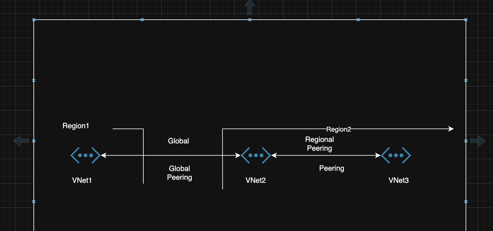
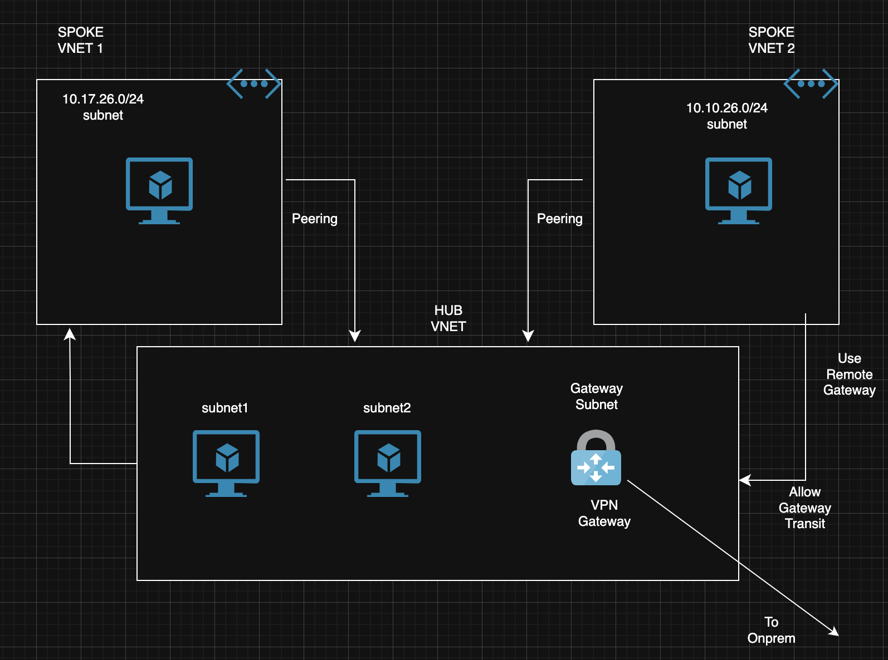

# Cross VNet Connectivity with Peering

Azure Virtual Network Peering is a powerfull feature. Peering allows you to connect different virtual networks within or across regions seamlessly.

This type of connection offers high speed, low latency networking without using the public internet, and ensure all traffic remains on the secure Microsoft backbone network.

There are 2 types peering
* Regional Peering (peering within same region)
* Global Peering (connects Vnets across different Azure regions)

Features

* VNet peering requires no gateways and the  connection has low latency and high bandwidth
* You can apply any changes on either VNET subnet to control access and define permissions for traffic between Vnets.
* VNets can be peered across different Azure subscriptions and even across different Microsoft Entra tenants.
* Peering does not cause any interruption to the services running on either network.
* Gateway transit enables one VNet to share its gateway with peered virtual networks.
* Essentially, it allows peered VNets to access on-premises resources through the VPN Gateway or ExpressRoute Gateway in another VNet.
* This shared Gateway configuration simplifies management and reduces the need for each Virtual Network to have its own Gateway
* This shared gateway configuration streamlines management and eliminates the need for each virtual network to have its own gateway.

