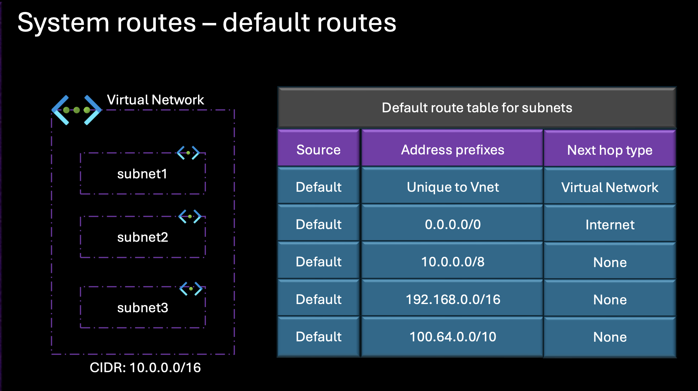
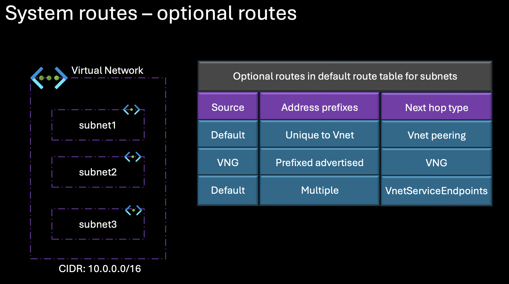

# Virtual Network Traffic Routing

## System Routes - Default routes

* Azure automatically creates a route table for each subnet within an Azure Virtual Network, and adds System Default Routes to that route table.
* Azure System Default Routes can be overridden by custom routes, and additional custom routes can be added to the route table
* Azure routes outbound traffic from a subnet based on the routes in a subnets route table.

* Hop Type **Virtual Network** routes traffic within a virtual network.
* Azure automatically creates a route for each defined address range within a virtual network.This means that traffic between subnets is routed internally. No external resources or gateways are needed.
* Next hop type as **Internet** routes traffic to the internet for any destination outside the virtual network.
* Azure has a default route for external traffic using the address prefix, which is 0.0.0.0/0, which essentially means everything else. Any address not matching your virtual network internal address space is routed to the internet.
* However, if the traffic is going to an Azure service like a Azure Storage. Azure keeps it within the Azure network and will skip the public internet for added security and speed.
* Next hop type **None** blocks specific traffic and drops it instead of routing it. 
* For certain private or reserved IP ranges like 10.0.0.0/8, 192.168.0.0/16 and 100.64.0.0/10 Azure creates a none route in the default system route table. Traffic destined for theses ranges is blocked by default, but if you assign any of these ranges as part of your virtual network address space, Azure updates the route to Virtual Network and this allows the traffic within your virtual network.
* In special case, if you define an address range in your virtual network that overlaps with a reserved range but isn't an exact match, Azure removes the default none route for that range and replaces it with a custom virtual network route to handle traffic within that range specifically.
* This structure of system route table ensures that traffic within your virtual network. Outbound internet traffic and any reserved IP ranges each have a clear and specific routing path.

#### How to check Default System Routes

* On the portal we can't see any default routes / or any routes assigned to the subnet.
* There's way to check these routes, Deploy a VM in a subnet open the NiC card (Network Interface) and select Effective Routes 

### System Routes - Optional Routes

* Azure Virtual Network Routing automatically creates Optional Default Routes when certain Azure features are enabled.
* These routes are applied either to all subnets in a VNET or to specific subnets, depending on the feature in use.

* Next Hop type **VNet peering** allows two virtual networks to connect and communicate as they were part of the same network.
* When you create a peering connection between two virtual networks, Azure adds a route for each address range within each virtual network address space. This allows traffic between them without needing additional routing configuration. When this happens, routes are added for all subnets in the virtual network.
* Next Hop type **Virtual Network Gateway(VNG)**, connects your Azure Virtual Network to an on premise network using a VPN or express route gateway.
* When a virtual network gateway is created, Azure adds a route to connect to on premise address range. If you are using BGP, any routes advertised from the on premises network gateway will also be added.
* These are managed by the Virtual Network Gateway and the next hop is always directed through the gateway. In this case as well routes are added for all subnets in the VNet.
* Next hop type **Virtual Network Service Endpoint** (VNETServiceEndpoints) provides a secure direct connection to specific Azure services such as Azure Storage or Azure SQL, without traversing the internet.
* When a service endpoint is enabled on a subnet, Azure adds a route for the service public IP to that subnet.
* This ensures traffic for the service is routed securely within the Azure backbone.
* The route table is updated automatically as the service IP change.
* Such routes are only added to the subnet where the service endpoint is enabled.

Overall, these optional routes streamline connectivity within Azure Vnets, simplify secure access to Azure services, and enhance on premise integration through BGP or custom routes.

#### How to check Optional System Routes

* First enable the service endpoints on the subnet. (eg. Storage Accouint, SQL )

* PaaS services by default comes with a public endpoint that means traffic can traverse over the open internet for those endpoints.
* By enabling the service endpoint means that the traffic from the Virtual Network to the PaaS services would be on the Azure backbone it won't traverse to the open internet.
* Once Service Endpoint is enabled, open the VM Nic Card, select Effective Routes and it should display optional routes added for VNETServiceEndpoints.
* To check VNET Peering route - Peer two vnets, and validate the Effective routes on Nic Card.
* Similar way VNG routes can be seen once VNG is setup.